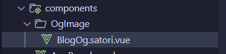
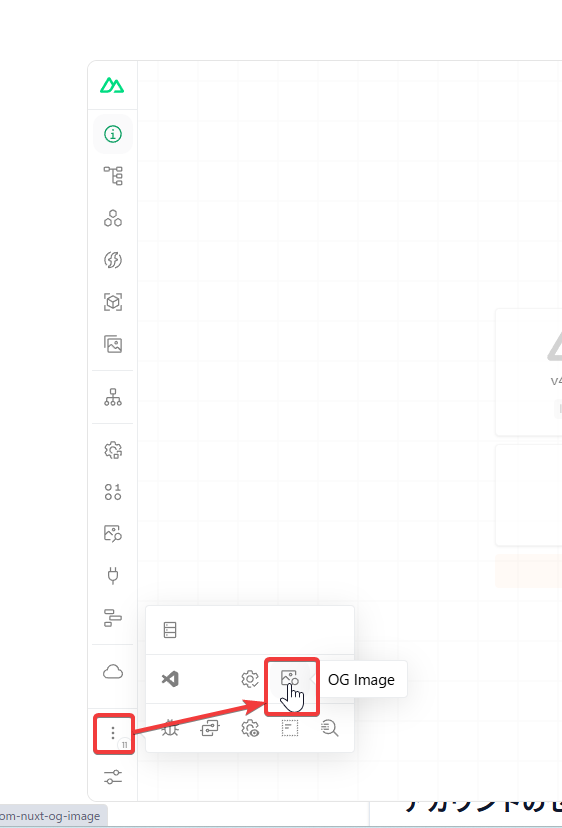
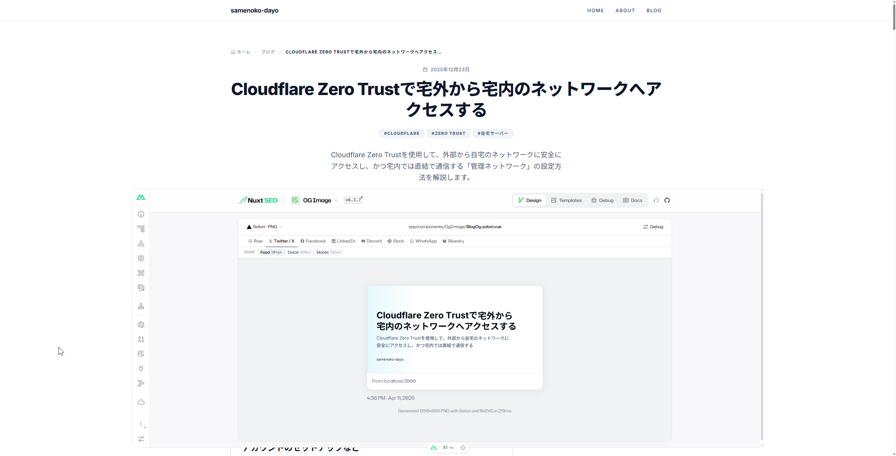

## 実はね…

実はOGP画像を生成するAPIをHonoで書きました。  
理由としては`nuxt-og-image` で上手く生成出来なかったから…。

だったんですけどね。

## satoriを使うようにした

速さに目が眩んでtakumiを使うようにしたんですけど、フォントが上手く渡せなくてね。  
一部が豆腐になったり、日本語フォントが表示されなかったり。

試しにSatoriを使うようにしたんです。そしたら上手くいった。

## 手順

### nuxt-og-imageのインストール

[https://nuxt.com/modules/og-image](https://nuxt.com/modules/og-image)

```shell
bunx nuxi module add og-image
```

これでnuxt-og-imageがインストールされた。

### satoriの有効化

```shell
bunx nuxt-og-image enable satori
```

これでsatoriとその依存関係がインストールされる。

### budouxのインストール

[https://github.com/google/budoux](https://github.com/google/budoux)

```shell
bun add budoux
```

日本語を分かち書きしていい感じに改行できるようにしました。

### フォントの設定

まず`@nuxt/fonts` を入れます。

```shell
bunx nuxi module add fonts
```

そしたら`public/fonts` にフォントファイルを入れます。日本語のやつだけでOKです。  
今回はNoto Sans JPのBoldとMediumを。

続いて`nuxt.config.ts` を設定します。以下を追加。

```typescript
fonts: {
    families: [
        {
            name: "Inter",
            weights: [500, 700],
            provider: "google",
            global: true,
            preload: true
        },
        {
            name: "Noto Sans JP",
            src: "/fonts/NotoSansJP-Bold.ttf",
            weight: 700,
            global: true,
            preload: true
        },
        {
            name: "Noto Sans JP",
            src: "/fonts/NotoSansJP-Medium.ttf",
            weight: 500,
            global: true,
            preload: true
        }
    ]
}
```

### コンポーネントの作成

OGP画像用のコンポーネントを作成します。  
`app/components/OgImage/BlogOg.satori.vue` を作成します。



ファイルの中身は以下のように。

```vue
<script setup lang="ts">
import { loadDefaultJapaneseParser } from "budoux";
const props = defineProps<{
  title: string;
  description: string;
}>();
const parser = loadDefaultJapaneseParser();

const titleWords = parser.parse(props.title);
const descriptionWords = parser.parse(props.description);
</script>

<template>
  <div class="w-full h-screen flex flex-col justify-center text-gray-950 p-16 relative" :style="{
    fontFamily: 'Inter, Noto Sans JP, sans-serif',
    background:
      'linear-gradient(90deg, rgba(230, 249, 255, 1) 0%, rgba(255, 255, 255, 1) 30%, rgba(255, 255, 255, 1) 100%)',
  }">
    <div class="flex flex-col">
      <div class="flex flex-wrap text-6xl font-bold leading-[1.2] overflow-hidden" style="max-height: calc(1.2em * 3);">
        <span v-for="(word, index) in titleWords" :key="index">{{ word }}</span>
      </div>
      <div class="flex flex-wrap mt-6 text-3xl font-medium text-slate-600 leading-relaxed max-w-[90%] overflow-hidden"
        style="max-height: calc(1.625em * 2);">
        <span v-for="(word, index) in descriptionWords" :key="index">{{ word }}</span>
      </div>
    </div>

    <div class="absolute bottom-16 left-16">
      <p class="text-2xl font-medium text-gray-800">Your Site Name</p>
    </div>
  </div>
</template>
```

### OGP画像を設定

あとはOGP画像を設定したいページに追加していくだけです。  
例として`app/pages/blog/[...slug].vue`に。

```vue
<script setup lang="ts">
// 他の設定

defineOgImage("BlogOg.satori", {
  title: post.value?.title,
  description: post.value?.description,
}, {
  emojis: 'twemoji',
  fonts: ["Inter", "Noto Sans JP"]
})

// 他の設定
</script>
```

これでOK！

## 確認する

開発サーバーを起動して、プレビューを開きます。  
Shift+Alt+Dで開発者メニューを開いて



三点リーダー → OG Imageをクリック。



こんな感じでOG画像が生成され、表示されればOKです！

## おわり

以上です。

別に速度が遅くなったとかは無いので、ただ単純に便利で楽なだけですね。