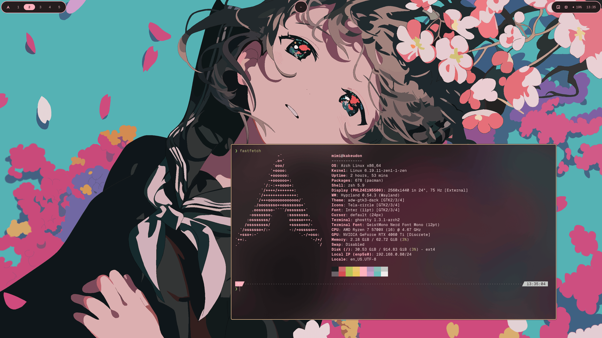

## 私のデスクトップ環境

まぁこんな感じのシンプルなものなんですけどね。

自分用ではありますけど、一応公開しています。

https://github.com/samenoko-dayo/dotfiles

## 使っているもの

- Hyprland
- Ghostty
- matugen
- awww
- walker
- waybar
- mako
- brave

みたいな感じかな。ブラウザに関してはbraveがNVIDIA環境で安定していた。

## では

本当に内容が無いですけども。使ってみてください。

…。使わねぇか。