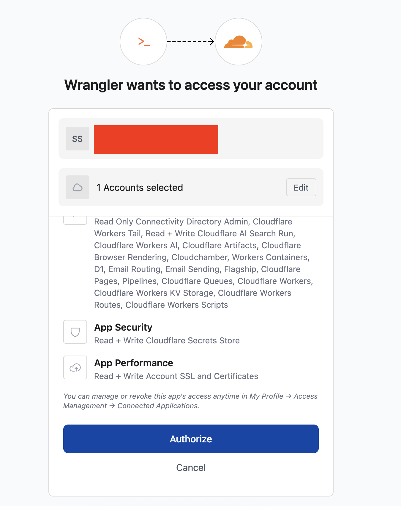
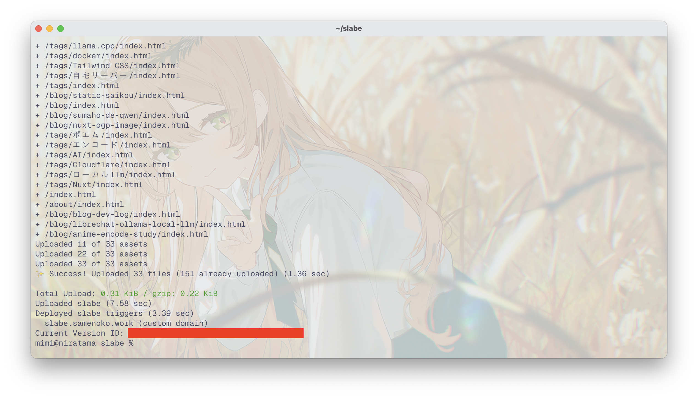

## 静的サイトのホスティングを選ぶ

静的サイトのホスト先って悩みますよね。正直私はCloudflare一択だと思うんですけど選択肢は結構あります。

### GitHub Pages

[https://docs.github.com/ja/pages/getting-started-with-github-pages/creating-a-github-pages-site](https://docs.github.com/ja/pages/getting-started-with-github-pages/creating-a-github-pages-site)

GitHubのサービスです。お手軽という点はありますが商用利用できないので広告をはっつけたサイトとかは不可。  
あとプライベートリポジトリでは利用できない(無料プラン)ので、ソースを非公開にしたい人は厳しい。

### Cloudflare Pages

[https://www.cloudflare.com/ja-jp/developer-platform/products/pages/](https://www.cloudflare.com/ja-jp/developer-platform/products/pages/)

Cloudflareの提供する静的サイトのホスティングサービスです。  
商用利用可能で転送量に制限がありません。CloudflareのCDNを通じた高速な配信もできるのでとても強いです。

### Vercel

[https://vercel.com](https://vercel.com)

VercelもCDNが強いので配信速度に関しては問題ないです。ただ転送量などに制限があるため完全無料かと言われると微妙。  
何かの拍子に跳ねたり、攻撃を喰らったら配信ができなくなる・請求が増えるリスクがある。

### Netlify

[https://www.netlify.com/](https://www.netlify.com/)

Vercelと同じような感じ。ただCDNサーバーが日本に無いらしく、実際ページの表示速度は遅い。  
こだわりというか、何か特別な思いがない限りこのサービスを使う必要はないと思う。

## Workers移行

PagesでできることはほとんどWorkersでもできます。そして静的サイトのホスティングならリクエスト数を消費しません。

wranglerでシンプルにデプロイできるようになるため、Workersの方が楽という説もあります。

## デプロイするまで

### `wrangler`をインストール

```shell
bun add wrangler@latest
```

でインストールします。

### ログイン

```shell
bunx wrangler login
```

を実行するとブラウザが開きます。そのブラウザでログインしてください。



こんな画面です。

```shell
bunx wrangler whoami
```

を実行して自分のアカウント情報が出てきたらOKです！

### `wrangler.jsonc`を作成

プロジェクトのルートに`wrangler.jsonc` を作成します。

```jsonc
{
    "$schema": "./node_modules/wrangler/config-schema.json",
    "name": "yourprojectname",
    "compatibility_date": "2026-04-14",
    "assets": {
        "directory": "./dist"
    },
    "routes": [
        {
            "pattern": "blog.example.org",
            "custom_domain": true
        }
    ]
}
```

ご自身の環境に合わせて適宜変更していただきたいですが、大枠はこんな感じです。

### デプロイする

```shell
bunx wrangler deploy
```

これでデプロイできます。



ログはこんな感じ。

## Actionsを書いた

このブログでもActionsを使ってビルド→デプロイしています。実際のワークフローは

```yaml title="build.yml"
name: Build and Deploy

on:
  push:
    branches: [main]
  workflow_dispatch:

jobs:
  build:
    runs-on: ubuntu-latest
    env:
      TZ: "Asia/Tokyo"
    steps:
      - name: Checkout
        uses: actions/checkout@v6
      - name: Setup Node.js
        uses: actions/setup-node@v6
        with:
          node-version: lts/*
      - name: Setup bun
        uses: oven-sh/setup-bun@0c5077e51419868618aeaa5fe8019c62421857d6
      - name: Install Dependencies
        run: bun install
      - name: Build
        run: bun run build
      - name: Deploy
        uses: cloudflare/wrangler-action@v3
        with:
          apiToken: ${{ secrets.CLOUDFLARE_API_TOKEN }}
          accountId: ${{ secrets.CLOUDFLARE_ACCOUNT_ID }}
          packageManager: bun
```

チェックアウトして、nodeとbunをセットアップして、依存関係入れて、ビルドして、デプロイ。

APIトークンなどの取得方法は後で書きます。(ごめんね🙏)

## パフォーマンス

このサイトを見る時に感じたままだと思います。

悪くはないでしょう。実装する時にパフォーマンスはそこまで気にかけてませんから、雑に書いてもこのくらいですよ。

## おわり

Cloudflareがないと生きられない身体にされちまってるよ…。

