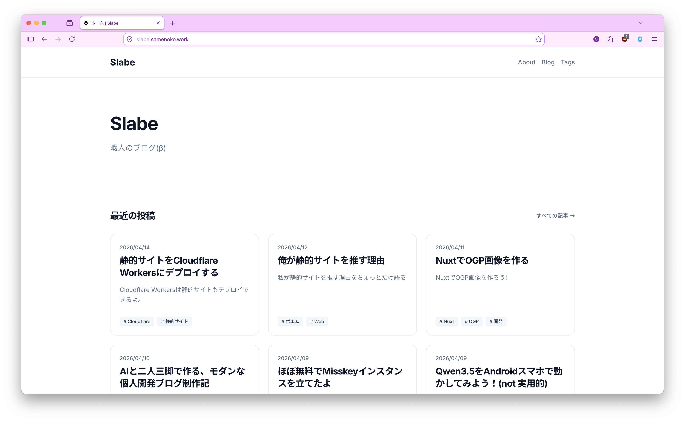

## About

このサイトはいい感じのブログです。嘘です。カスみたいなブログです。  
そうですね。

## 技術スタック

使用しているモノたちです。

### Astro

[https://astro.build/](https://nuxt.com/)

静的サイトジェネレーターです。書き慣れているのはAstroなんだけど、なんとなくで選んだんだよ。

### Pages CMS

[https://pagescms.org/](https://pagescms.org/)

Gitでコンテンツを管理できるCMSです。webで執筆可能で、楽。

### TailwindCSS / typography

[https://tailwindcss.com/](https://tailwindcss.com/)

スタイリングの定番。ちょっと苦手。

### takumi

[https://takumi.kane.tw/](https://takumi.kane.tw/)

OG画像生成用です。satoriよりも高速らしいです。  
あと変換を噛ませる必要がないのも楽。

### Cloudflare Workers

[https://www.cloudflare.com/ja-jp/developer-platform/products/workers/](https://www.cloudflare.com/ja-jp/developer-platform/products/workers/)

デプロイに使っています。

